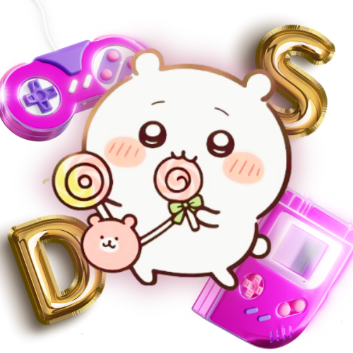

# Project Proposal
## WDProjStrontiumDulaySaquing

1. Final Title: ChiikArcade

2. Second Sub-Title: Welcome to the ChiikArcade!

3. Canva Link for our Logo: 

4. Our website project is an "arcade" style website, that has many games, an in-game shop, and even an about me about the authors! We hope that the games we made using JavaScript and CSS will be fun to play!

5.  Outline:
    - Homepage (Index, Page 1): This is our main menu for the entire website handling. This is where users will first see the buttons for the entrance to the arcade, (in-game) shop, and the about me of the authors.

    - Arcade (Page 2): This is the main Game page, where all four games are posted, and could each lead to another webpage of their respective games.

    - Shop (Page 3): This is a webpage where the user can spend game tokens to design the shop more. Game tokens are won from playing games.

    - About (Page 4): This is an about me webpage about the developers of the webpage. This also includes a button for another webpage called the Contacts and Information page.

    - Contacts and Information (Page 5): This is the webpage that showcases the contact info and institution the developers made this webpage under. 

    - Bonus page: If a letter on the main title of the homepage is clicked, a meme photo of one of the developers will show.

6. JavaScript will be used in our webpage as a tool for analytical and conditional statements such as the mechanics of the games, a webpage counter, and more.

7. Wireframe canva link: https://www.canva.com/design/DAG3E7_ZlEY/vfvPFWvRJyvHv0_Kp_wUKQ/edit?utm_content=DAG3E7_ZlEY&utm_campaign=designshare&utm_medium=link2&utm_source=sharebutton

8. The navigation design is based solely on large png of buttons, used as a navigation tool such as turning to the next page, going to the game webpage, etc.

Features (So far):
- Three games out of five is done and working for laptop players.
- These three games are fully furnished with animations as well.
- Excluding the games, the fully furnished webpages are the:
    - Homepage
    - Shop webpage (including the preview of new purchasable themes)
    - About webpage

Definition of Done:
- The remaining two games are finished and fully working.
- All controls are fully working on both laptop and mobile.
- Coin system is now working.
- Purchased themes now apply to webpages.

Details for the Form:
- The form will appear on the screen before users can go to the Homepage.
- The use of this form is to collect the user data (username and password) for leaderboards, coin progress, etc.
- The data will be stored in local storage

UPDATES as of March 18, 2026

- Updated games :D

- Adjusting Login and Sign-in 

Questions:

## He/She/They wil love this project because:
This project is for users who want to recreate the real-life arcade experience without the loss of funds and without losing the comfort of your own space. Additionally, this project is also suitable for those who love the Japanese cartoon Chiikawa. Our characters span from the lovable Usagi to the less-known Anoko--which showcases the creator's appreciation and dedication into creating not just a well-coded game, but a well-designed theme of the game. 

## This project features/includes:
They will love this project because it simulates the emotions ones may get from a real-life arcade experience, whether it be a raise of cortisol or a spike in dopamine. This project also targets a specific demographic from the theme (both arcade-lovers and Chiikawa lovers) which the game has incorporated well. Our experience incorporates the themes of a character (e.g Usagi's love for eating) and integrates it into a well-loved game (e.g snake) and combines them to create an experience the user will enjoy. 

This project features themed games spanning from:
Save The Chiikaw-lings! (Claw Machine)
Save your favorite Chiikawa characters from the claw machine and receive a fun 3-d character-card!
Usagi's Snack Run (PacMan) 
Usagi's hungry! Guide them through the maze and avoid different characters who want to steal their food. 
Chiikabu's Pudding Chase (Snake)
Usagi's not the only one whose hungry... Make Chiikabu bigger and bigger as they eat the puddings around the field. 
Roll For Hachi! (Slot Machine)
Where's Hachiware? Piece him back together and win a fun-filled prize! 
Pa-Chii-nko (Pachinko/Plinko) 
Chiikawa, Hachiware, and Usagi want to have some fun :) Score some points and shoot the balls into their respective point-baskets!

## This project does NOT include:
This project does not include real-life prizes, any licensed Chiikawa merchandise, or gambling arcade games. You do not need to spend to play our games.

## Submited by Uno Dulay and Rei Saquing on March 18,2026 to Sir Roy from PSHS-MC in Partial fulfillment of the requirements in CS3 of DOST-PSHS-MC